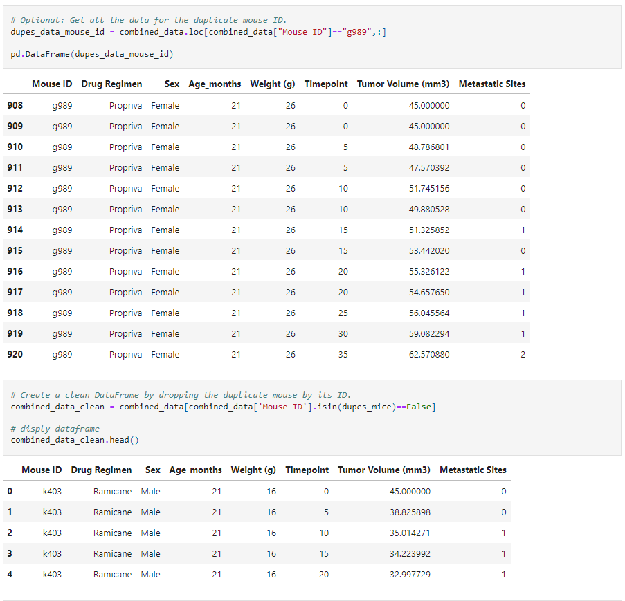
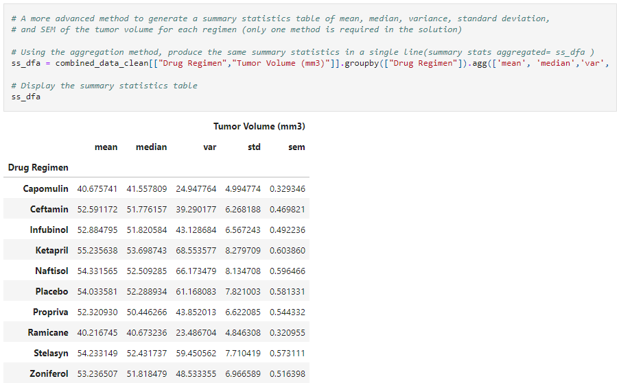
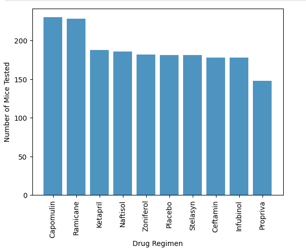
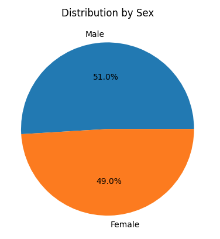
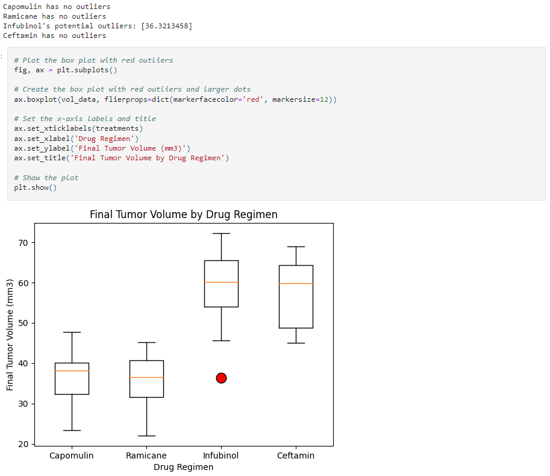
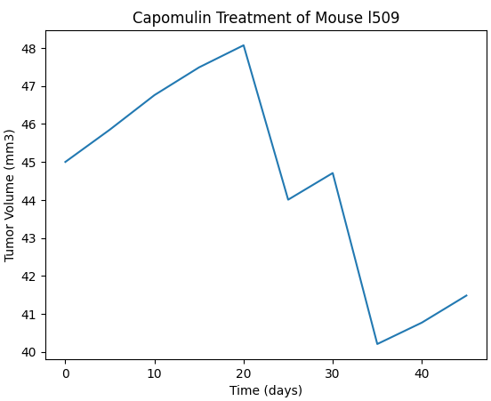
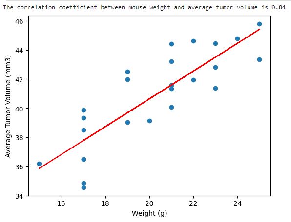

# Matplotlib_Challenge

Pymaceuticals, Inc., a new pharmaceutical company that specializes in anti-cancer medications. Recently, it began screening for potential treatments for squamous cell carcinoma (SCC), a commonly occurring form of skin cancer.

In this study, 249 mice who were identified with SCC tumors received treatment with a range of drug regimens. Over the course of 45 days, tumor development was observed and measured. The purpose of this study was to compare the performance of Pymaceuticals’ drug of interest, Capomulin, against the other treatment regimens.

I have been tasked with generating all of the tables and figures needed for the technical report of the clinical study and providing a top-level summary of the study results.

First, I prepared the data by removing the duplicate mouse data (g989).

Next, generated summary statistics that includes a row for each drug regimen and a column for each of the following statistics: mean, median, variance, standard deviation, and SEM of the tumor volume.

Then, I created a bar charts and pie charts showing the total number of rows and to show the distribution of female versus male mice in the study.

Next, I calculated the quartitles to find outliers, which is represented in the Box Plot. 

Finally, I created a line plot of mouse I509 to show the tumor volume versus point in time (via days) and a scatter plot of mouse weight versus average observed tumor volume for the entire Capomulin regimen; adding the linear regression model.

Analysis:

Capomulin and Ramicane are more effective in reducing the size of tumors than Infubinol and Ceftamine; with Infubinol having 1 outlier.

We should note that both Capomulin and Ramicane were used more during the testing than the other drugs during the study.

When looking at the linear regression, weight has a strong positive correlation (84%) when compared to average Tumor volume. We can concluded that the heavier the mouse, the larger the volume of the tumor.